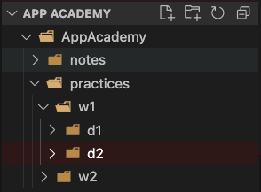
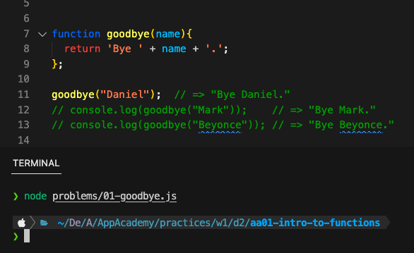
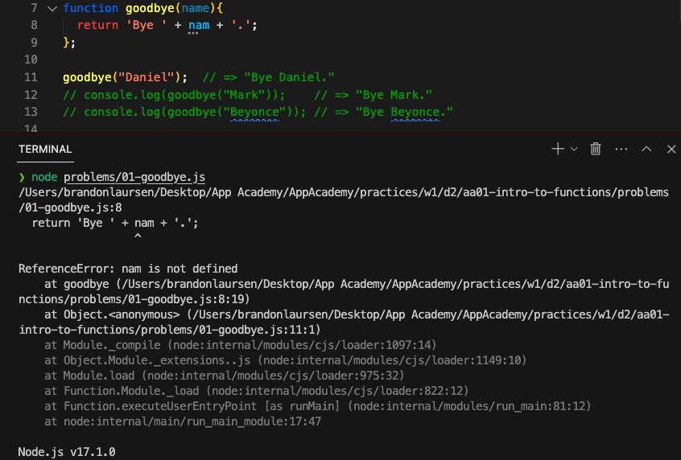
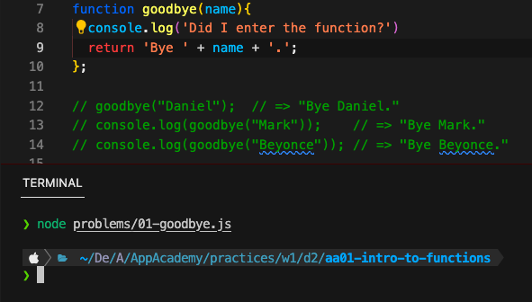
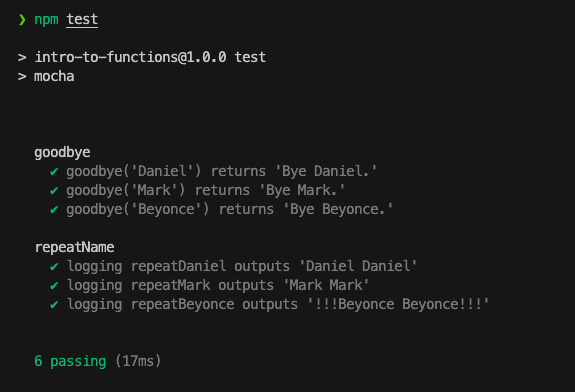

# Terminal and Local JavaScript

## Steps to Run Project Locally

`WSL2 users make sure to use ubuntu terminal!`

### 1. From your terminal locate where you want to store your practice

This could be in your App Academy Folder

### 2. `cd` into the folder

### 3. Copy the tiged command from the github repo

### 4. Paste the command into your terminal

### 5. `cd` into the file you just cloned

`Make sure when you run ls this is what you see`

### 6. Run npm install

`No worries if you see vulnerabilities; that is normal`

## How to run file using node

From the root of the directory run `node problems/<problemFileName>`

### Some things to note!

If there is no `console.log` nothing will print to the terminal

If there are errors in the code; errors will be printed to the terminal

-   Make sure to read your error messages carefully!
-   In this case, we have a spelling error, `nam` is not defined!

If the function isnt called; the function will not run!

## How to run the test specs

### Running a single test spec

From the root of the directory run `npm test test/<testFileName>`

#### Some things to note!

Make sure there are no errors in your code or the specs will break!

-   In this case we have a syntax error
-   Make sure youre at the root of your directory and not in the problems folder or you may see this

### Running all the test specs

From the root of the directory run `npm test`

# Node

## What is node?

runtime environment that allows us to run js outside the browser

## What is node repl?

-   repl you can use to run quick test on your terminal
    -   to exit use `.exit`

## What is NPM?

-   Node package manager
    -   Tool that allows developers to easily install, manage, and share JavaScript libraries and packages with other developers

## What is NVM?

Tool that allows us manage and change what version of node we are using

## What is a Package.json?

-   holds all the meta data of your project such as name, versions, and dependencies
-   Whenever you see a package.json you npm install to install the dependencies

## What is npm install?

-   How we install the dependencies within the package.json
-   When you npm install, two things are generated
    1. package-lock.json
    2. node_modules

## Package-lock.json

-   Keep track of dependencies and ensure all who download get the same tree of dependencies stores exact copy version
-   It describes the exact tree that was generated, such that subsequent installs are able to generate identical trees, regardless of intermediate dependency updates.

## Node_modules

Holds all the dependencies of your project

## What is mocha?

A testing framework for running js in node

## How to run mocha

when you run mocha, make sure youre at the root so that were able to go into the test folder

-   `npm test test/filename`: Run a single test file
-   `npm test`: Run all files

## Relative Path

A relative path describes the location of a file relative to the current (working) directory.

## Absolute Path

An absolute path describes the location from the root directory.