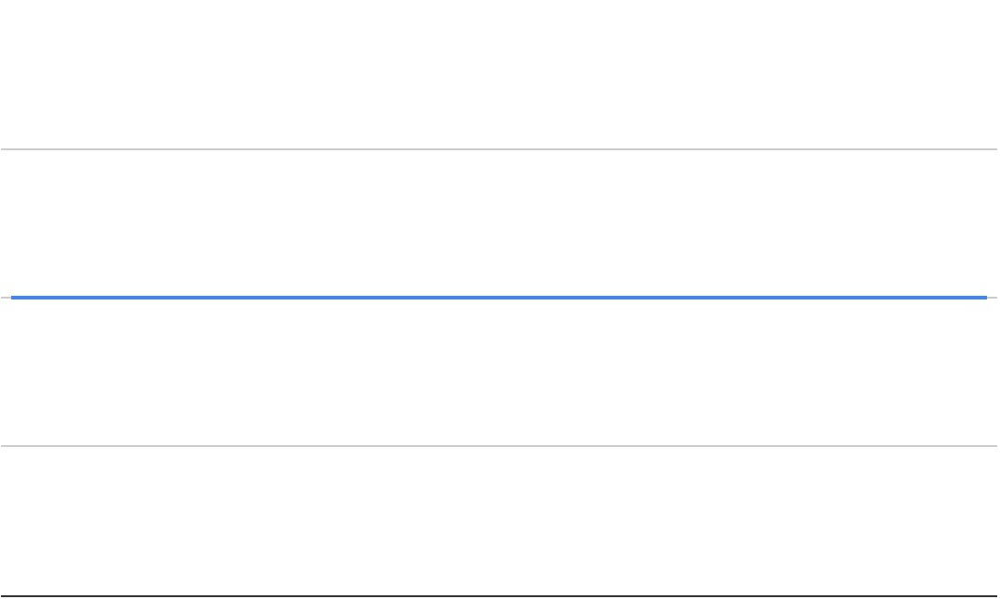

# M2-W5-D1

- Assessment
- Timing Benchmarks
- Big O

## Big-O Notation Basics

The biggest thing to remember when using Big-O notation (O stands for order) is that
we are not concerned with exact values, we are looking at growth curves and
worst case scenarios.

The strength of this form of measurement is in understanding efficiency at scale.
An important thing to remember is effeciency at scale is not always the best metric to use for all programming problems.
It is a general rule that becomes increasingly important as your input size grows. 

### Constant Growth



```js
// No matter the size of the input the time complexity remains constant.

const add = (num1, num2) => num1 + num2;
```

### Linear Growth


```js
// The time complexity grows linearly, directly corresponding to the size of the input.

const addToN = (n) => {
  let total = 0;

  for(let i = 1; i <= n; i++){
    total += n;
  }
  return total;
}
```

### Quadratic Growth


```js
// exponentially grows dependent on input.
// n*n number of times.

function printPairSums(n) {

  for (let i = 0 ; i < n ; i++) {

    for (let j = 0 ; j < n ; j++) {
      console.log(`${i} + ${j} = ${i + j}`);
    }

  }
}
```

## Deducing Efficiency

Ignore Coefficients

```
  5n => n
  2n^2 => n^2
  5 => 1 
```

Ignore Insignificant Factors

```
 n^2 + n => n^2
 5 + n => n 
```

Lets Practice!
```
5n^2 + 2n + 5 => n^2 + n + 1 => n^2

n * n + n => n^2 + n => n^2

2 + 3 => 1 + 1 => 1
```


```js
//time complexity 

function printTripleSums(n) { 
  
  // n*n*n => n^3
  for (let i = 0 ; i < n ; i++) { //n

    for (let j = 0 ; j < n ; j++) { //n
 
      for (let k = 0 ; k < n ; k++) {//n
        console.log(`${i} + ${j} + ${k} = ${i + j + k}`);
      }
    }
  }
}

function printLettersNTimes(n) {

  const letters = "abcdefghijklmnopqrstuvwxyz";

  //1 * n => n
  for (let i = 0 ; i < letters.length ; i++) { //1

    for (let j = 0 ; j < n ; j++) { // n
      console.log(letters[i]);
    }
  }
}

function printNumbersTwice(n) {
  

  // n + n => n
  for (let i = 0 ; i < n ; i++) { // n
    console.log(i);
  }

  for (let j = 0 ; j < n ; j++) { // n
    console.log(j);
  }
}

function printPairSumsThenPrintNums(n) {


  // n^2 + n => n^2
  for (let i = 0 ; i < n ; i++) { // n

    for (let j = 0 ; j < n ; j++) { // n
      console.log(`${i} + ${j} = ${i + j}`);
    }
  }

  for (let k = 0 ; k < n ; k++) { // n
    console.log(k);
  }
}
```

```js
//space complexity

const addNums = (n1, n2) => n1 + n2; // 1

function createMatrix(max){ //1
    const matrix = []; //n*n => n^2

    for(let i = 0; i < max; i++){
        matrix.push([]); // n
        for(let j = 0; j < max; j++){
            matrix[i].push(j); // n
        }
    }

    return matrix;
};

const transformArr = (arr) => arr.map(x => x*2); // n
```

## Timing Benchmarks Practice (SOLO, 45m)

```js
console.time
Date.now
```

## Timing Benchmarks Practice Walkthrough

## Big-O Practice (Collab)

## Array Methods Practice (Collab)

## Array Methods Long Practice (PAIRED)
