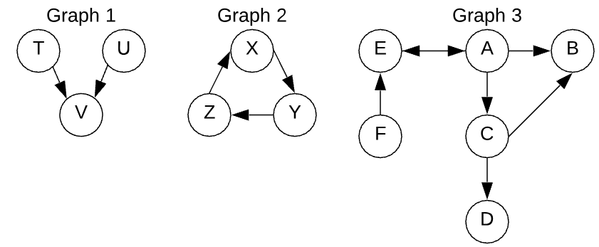

# M2-W6-D4

- Graphs
    - Adjacency Lists
    - Matrices

## Graphs

### What is a graph?

**...EVERYTHING!**

- Linked Lists
- Trees
- anything with a node and a pointer!

### Graph Vocabulary

- Vertex: A node in the graph. Vertex and node can be used interchangeably
- Directed edge: A one-way connection from one vertex to another
- Undirected edge/Bidirectional edge: A two-way connection between two vertices
  that can be traversed in either direction
- Edge weight: The cost of traversing an edge. (This would be equivlent to the
  lines/edges in the whole graph having lengths)
- Cyclic/acyclic: A cyclic graph is a graph with at least 1 cycle

### Adjacency Lists



```js
const graph1 = {
  T: ['V'],
  U: ['V'],
  V: [],
}
const graph2 = {
  X: ['Y'],
  Y: ['Z'],
  Z: ['X'],
}
const graph3 = {
  A: ['B', 'C', 'E'],
  B: [],
  C: ['B', 'D'],
  D: [],
  E: ['A'],
  F: ['E'],
}
```


```js
//an undirected graph may look like this:
const undirected = {
  1: [2, 5],
  2: [1, 3, 5],
  3: [2, 4],
  4: [3, 5, 6],
  5: [1, 2, 4],
  6: [4],
}
```

## Traversing Graphs (Example Patterns)

### BFS

- Create a queue and enqueue the starting node
- Create a set to store visited nodes
- While the queue is not empty, repeat steps 4-6
  - Dequeue the first node
  - DO THE THING THAT YOU NEED TO FOR THE DEQUEUED NODE
  - For each unvisited neighbor, add it to the visited nodes and to the back of
   the queue

### DFS

- Create a stack and push the starting node
- Create a set to store visited nodes, and add the starting node
- While the stack is not empty, repeat steps 4-6
  - Pop the node on the top of the stack.
  - DO THE THING THAT YOU NEED TO FOR THE DEQUEUED NODE
    -  For example, add it to a running total, print it, or save it in an array
    - For each unvisited neighbor, add it to the visited nodes and to the top
    of the stack.

## Practice: Refactor Breadth First Traversal (SOLO, 20m)

## Walkthrough: Refactor Breadth First Traversal 

---

## Practice: Simple Breadth First Search (SOLO, 20m)

## Walkthrough: Simple Breadth First Search

---

## Practice: A Shortest Path (SOLO, 20m)

## Walkthrough: A Shortest Path

---

## Practice: Degrees of Separation (SOLO, 20m)

## Walkthrough: Degrees of Separation

---

## Practice: Social Graph pt1 (SOLO, 30m)

## Walkthrough: Social Graph

---

## Practice: Social Graph pt2 (SOLO, 30m)

## Walkthrough: Social Graph

---

## Matrix Graphs

1. We need to update find neighbors logic
2. we need to deal with a node being coordinates to a location in a matrix
3. we need to deal with a node being an array rather than a primitive

Other than that the logic will be fundamentally the same as the adjacency list bfs or the b-tree bfs.

```js
const matrix = [
    [1, 28, 32, 44],
    [12, 5, 10, 13],
    [51, 62, 73, 14],
    [2, 88, 19, 200]
];

const findNeighbors = () => {

};

//starting from matrix[0][0] can I find my target?
const bfs = (matrix, target) => {

};
```

---

## Practice: Breadth First Search with Matrix Practice (SOLO, 30m)

## Walkthrough: Breadth First Search with Matrix Practice

---

## Practice: Solving Graph Problems (SOLO, 40m)

## Walkthrough: Solving Graph Problems
